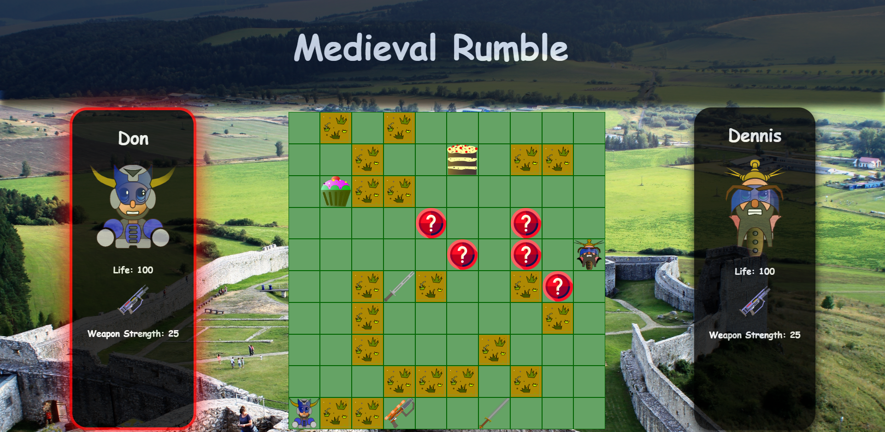

<h1>Turn Based Board Game</h1>
<ul>
    <li>Each player can move 3 spaces horizontally or vertically.</li>
    <li>Your current weapon is an machine gun with 25 points power.</li>
    <li>All the other weapons have different values.</li>
    <li>You can earn more points if you will cross the squares with a question mark and answer right to the question.</li>
    <li>If you answer correct you gain 15 life points.</li>
    <li>If you answer wrong you will loose 10 life points.</li>
    <li>When in battle you can attack or defend.</li>
</ul>

Here is the link: https://jacquesme.github.io/P6-Medieval-Rumble/

